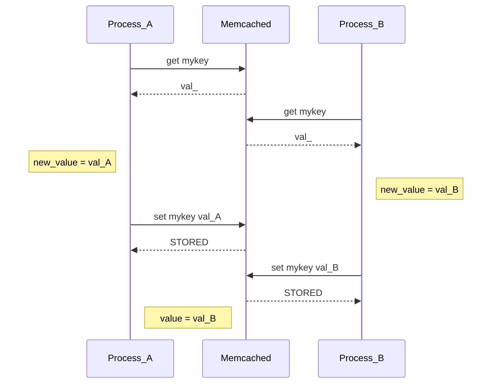

# Описание проблемы

Представьте, что вы используете memcached в качестве key-value хранилища. Вы хотите обновлять данные для ключа <key> на основе сохраненного значения. Memcached поддерживает команды `get` и `set`, и может возникнуть соблазн использовать именно их для решения данной проблемы:

```
old_value = get_value(key)                      # здесь мы вызовем команду memcached: get
new_value = update_value(key, old_value)
set_value(key, new_value)                       # здесь мы вызовем команду memcached: set
```

Такой вариант не подойдет, если к данным обращаются из нескольких потоков исполнения. Представим, что есть два процесса A и B. Они обращаются к ключу *mykey* в котором сохранено значение *val_*, и каждый процесс должен дописать свое имя к текущему значению. В результате должно получиться либо *val_AB* либо *val_BA* в зависимости от порядка, в котором процессы выполнятся. В примере ниже мы получим неверное значение *val_B*:



Для решения данной проблемы в memcached предусмотрены команды `gets` и `cas`. Первая возвращает значение ключа и некое число `<cas unique>`, последняя - принимает в качестве аргументов новое значение и `<cas unique>`. Если значение ключа поменялось между вызовами `gets` и `cas`, то memcached не будет обновлять данные и вернет соответствующий статус. В таком случае можно будет перезапросить новое значение командой `gets` и снова попробовать его обновить при помощи `cas`.

# Демонстрация проблемы

В директории **examples** размещены несколько примеров, в каждом из которых два потока исполнения пытаются конкурентно модифицировать данные. Вариант *nonatomic* использует команды `get` и `set` и подвержен описанной выше проблеме. Вариант *atomic* использует команды `add`, `gets` и `cas`.

## Требуемый софт

Если вы хотите запустить демонстрацию на MacOS или дистрибутиве Linux, то вам потребуется установленный docker. Для его установки вы можете воспользоваться соответствующей инструкцией с официального сайта docker.

Если по какой-то причине вы не хотите запускать примеры на своем компьютере (например, чтобы не устанавливать docker), то можно воспользоваться плейбуком для ansible, чтобы развернуть все необходимое окружение на виртуальном сервере с Ubuntu / CentOS. Для этого вам потребуется установленный ansible.

```
# установите на ваш компьютер ansible, например, на MacOS установка может выглядеть так:
brew install ansible


# запустите виртуальный сервер
# замените test-1 на IP-адрес вашей виртуалки в файле ansible/inventory.ini

make setup_hosts

tar zcpf - examples | ssh <your server IP address> "tar zxfp -"
ssh <your server IP address>
```

## Как запустить

В директории examples есть несколько примеров, написанных на разных языках программирования. Для каждого из примеров вы можете перейти в соответствующую директорию, поднять все необходимое окружение и запустить демонстрацию следующим образом:

```
cd examples/<subdirectory>

make up
make build

make run

make down
```

- **make up** запустит memcached в docker.
- **make build** соберет docker-контейнер с демонстрацией
- **make run** запустит демонстрацию с двумя вариантами выполнения: правильным (*atomic*) и неправильным (*nonatomic*)
- **make down** опустит контейнер с memcached

